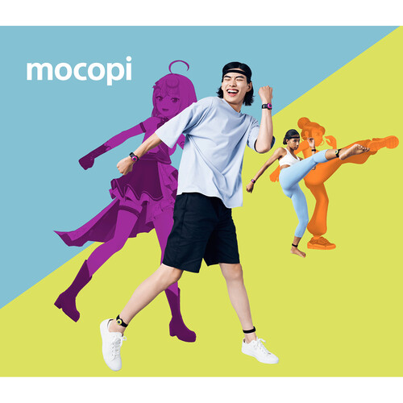
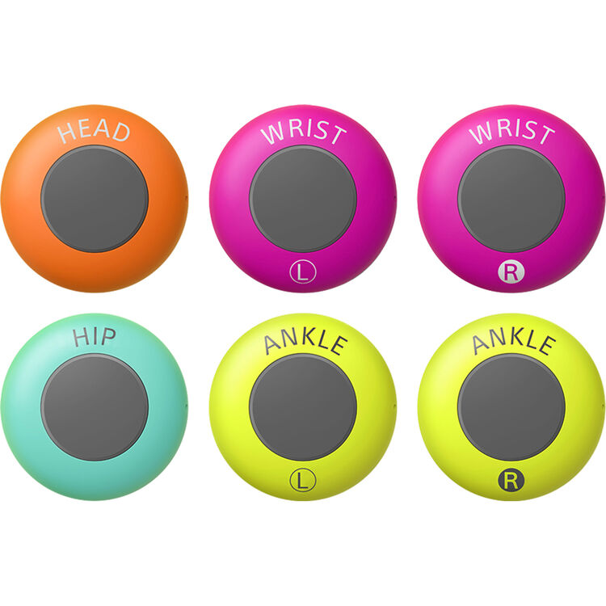

<picture>
  <source media="(prefers-color-scheme: dark)" srcset="README-ref/mocopi_logo_white.png">
  <source media="(prefers-color-scheme: light)" srcset="README-ref/mocopi_logo_black.png">
  
</picture>

<table>
<tr>
<td width="33%"></td>
<td width="33%"></td>
<td width="33%"></td>
</tr>
</table>

# Mocopi Receiver

A comprehensive motion capture integration package for streaming Sony mocopi sensor data to Snap Spectacles AR glasses. This package provides WebSocket client connectivity, automatic bone mapping, coordinate system conversion, surface placement integration, and real-time avatar animation with smooth interpolation for full-body motion tracking experiences.

> **Disclaimer**: This is an independent community project. It is not officially affiliated with, sponsored by, or endorsed by Sony or Snap Inc.

> **Note**: This package supports the **standard mocopi kit (6 sensors)**. For the 12-sensor Pro setup, see [mocopi Pro Kit](https://electronics.sony.com/more/mocopi/all-mocopi/p/qmss1-uscxp).

## Quick Start Video

[](https://www.youtube.com/watch?v=W11GrI0eP3Q)

▶️ **Click to watch the setup walkthrough**

## Resources

- **[Sony mocopi Product Page](https://electronics.sony.com/more/mocopi/all-mocopi/p/qmss1-uscxk)** - Learn more about the mocopi sensors
- **[Local Server Example](LocalServerExample/)** - Python relay server for streaming mocopi data

---

## Features

- **WebSocket Client**: Real-time motion data streaming with automatic reconnection
- **Automatic Bone Mapping**: Intelligent skeleton-to-avatar bone matching with name variation support
- **Coordinate System Conversion**: Unity/mocopi to Lens Studio coordinate transformation
- **Surface Placement Integration**: Place and position avatars in AR space using SurfacePlacement package
- **Smooth Interpolation**: Configurable lerp/slerp for natural motion
- **27 Bone Support**: Full-body tracking (root, spine, head, arms, legs)
- **Connection Statistics**: FPS tracking and connection health monitoring
- **Avatar Prefab Support**: Automatic detection and initialization from instantiated prefabs
- **Reset Functionality**: Reset placement and avatar pose at runtime
- **Debug Logging**: Comprehensive console output for troubleshooting

## Quick Start

Set up basic mocopi receiver with surface placement:

```typescript
import {MocopiMainController} from "MocopiReceiver.lspkg/Scripts/MocopiMainController";
import {MocopiWebSocketClient} from "MocopiReceiver.lspkg/Scripts/MocopiWebSocketClient";
import {MocopiAvatarController} from "MocopiReceiver.lspkg/Scripts/MocopiAvatarController";

@component
export class MocopiSetup extends BaseScriptComponent {
  @input avatarPrefab: ObjectPrefab;
  @input placementObject: SceneObject;

  private mainController: MocopiMainController;
  private webSocketClient: MocopiWebSocketClient;
  private avatarController: MocopiAvatarController;

  onAwake() {
    // Create WebSocket client
    this.webSocketClient = this.getSceneObject().createComponent("Component.ScriptComponent") as MocopiWebSocketClient;
    this.webSocketClient.serverUrl = "ws://YOUR_IP:8080";
    this.webSocketClient.autoConnect = true;

    // Create avatar controller
    this.avatarController = this.getSceneObject().createComponent("Component.ScriptComponent") as MocopiAvatarController;
    this.avatarController.updatePositions = false;
    this.avatarController.smoothFactor = 0.3;

    // Create main controller
    this.mainController = this.getSceneObject().createComponent("Component.ScriptComponent") as MocopiMainController;
    this.mainController.webSocketClient = this.webSocketClient;
    this.mainController.avatarController = this.avatarController;
    this.mainController.showAvatar = true;

    print("Mocopi receiver initialized");
  }
}
```

## Script Highlights

### MocopiMainController.ts

The central orchestrator that coordinates all mocopi system components. Manages the lifecycle of WebSocket client and avatar controller, routing events between components for skeleton definition and frame data. Provides unified API for connection management with connect(), disconnect(), and getConnectionStats() methods. Handles system initialization with component validation and comprehensive logging. Implements resetAvatarController() for prefab replacement scenarios and resetAvatar() for pose resets. Features event-driven architecture with callbacks for onConnected, onDisconnected, onSkeletonReceived, onFrameReceived, and onError events.

### MocopiAvatarController.ts

Manages avatar animation by mapping mocopi bone data to 3D character rigs with automatic bone detection across naming conventions. Integrates with PrefabPlacement to find and initialize avatar root from instantiated prefabs, searching for "human_low:_root" patterns in hierarchy. Implements automatic bone mapping with intelligent name matching supporting variations like "mixamorig:", "_jnt", "_bone", and Lens Studio avatar prefixes. Provides configurable transform updates with updatePositions toggle, applyCoordinateConversion for Unity-to-Lens-Studio conversion, and smoothFactor for lerp/slerp interpolation strength. Features coordinate system conversion with convertRotation() and convertPosition() handling handedness differences. Includes manual mapping API with mapBone(), unmapBone(), getBoneMappings(), and clearMappings() for custom rigging. Supports resetPose() to return avatar to T-pose and getStats() for debugging mapping status.

### MocopiWebSocketClient.ts

Handles real-time WebSocket connectivity to mocopi relay server with automatic reconnection logic. Manages connection lifecycle with configurable maxReconnectAttempts and reconnectInterval for resilient streaming. Implements binary message handling via InternetModule with blob-based data reception and JSON parsing. Provides connection statistics tracking including framesReceived, averageFPS (calculated over 30-frame window), and reconnectAttempts. Features event callback system with onSkeletonReceived, onFrameReceived, onConnected, onDisconnected, and onError for external integration. Includes request_skeleton message protocol for skeleton definition synchronization. Supports both ws:// (local testing) and wss:// (production) protocols with configurable serverUrl. Implements automatic cleanup on destroy with proper WebSocket closure.

### PrefabPlacement.ts

Integrates SurfacePlacement package for AR positioning of mocopi avatars in world space. Provides three placement modes (Near Surface, Horizontal, Vertical) via PlacementSettings configuration. Manages prefab instantiation lifecycle with automatic cleanup of previous instances before starting new placement. Coordinates with MocopiMainController for avatar controller reset when replacing prefabs. Implements height adjustment widget callback with onSliderUpdated() for fine-tuning placement position. Features startPlacement() and resetPlacement() public methods for runtime control. Handles prefab parenting to objectVisuals at local (0,0,0) with identity rotation and unit scale for consistent placement. Includes onDestroy cleanup to prevent prefab leaks.

### ResetButton.ts

Simple UI integration component for triggering placement reset from SIK buttons or interactables. Provides onResetButtonPressed() callback designed for connection to button OnTriggerEnd events. Includes validation and error handling for missing PrefabPlacement assignment. Features alternative resetPlacement() method for programmatic triggering from external scripts.

### MocopiDataTypes.ts

Type definitions for mocopi motion capture data protocol with full TypeScript interfaces. Defines Vector3, Quaternion, MocopiBone with id/name/parent_id/rotation/position structure. Specifies SkeletonDefinition message type with num_bones and bones array for initial skeleton setup. Provides FrameData message type with frame_id and per-frame bone transforms. Includes MOCOPI_BONE_NAMES array with 27 bone names (root, torso_1-7, neck_1-2, head, l/r_shoulder/up_arm/low_arm/hand, l/r_up_leg/low_leg/foot/toes). Exports ConnectionStats interface for monitoring connected state, frames received, FPS, and reconnection attempts.

## Core API Methods

### MocopiMainController

```typescript
// Component references (required inputs)
@input webSocketClient: MocopiWebSocketClient
@input avatarController: MocopiAvatarController

// System settings
@input showAvatar: boolean  // Enable/disable avatar display

// Public methods
connect(): void                          // Connect to mocopi server
disconnect(): void                       // Disconnect from server
resetAvatarController(): void            // Clear avatar for prefab replacement
resetAvatar(): void                      // Reset avatar to T-pose
getConnectionStats(): ConnectionStats    // Get connection health metrics

// Event callbacks (set these before initialization)
webSocketClient.onConnected: () => void
webSocketClient.onDisconnected: () => void
webSocketClient.onSkeletonReceived: (skeleton: SkeletonDefinition) => void
webSocketClient.onFrameReceived: (frame: FrameData) => void
webSocketClient.onError: (error: string) => void
```

### MocopiWebSocketClient

```typescript
// Server configuration
@input serverUrl: string                 // WebSocket URL (ws:// or wss://)
@input autoConnect: boolean              // Auto-connect on start
@input maxReconnectAttempts: number      // Max reconnection tries (0 = infinite)
@input reconnectInterval: number         // Seconds between reconnection attempts
@input enableDebugMode: boolean          // Enable detailed logging

// Public methods
connect(): void                          // Connect to server
disconnect(): void                       // Disconnect from server
sendMessage(message: any): boolean       // Send JSON message to server
getStats(): ConnectionStats              // Get connection statistics
```

### MocopiAvatarController

```typescript
// Avatar configuration
@input prefabPlacement: PrefabPlacement  // PrefabPlacement component reference

// Transform settings
@input updatePositions: boolean          // Update position (not just rotation)
@input applyCoordinateConversion: boolean // Unity to Lens Studio conversion
@input smoothFactor: number              // Interpolation strength (0-1)
@input avatarScale: number               // Position scale multiplier

// Public methods
initializeAvatar(skeleton: SkeletonDefinition): void  // Initialize with skeleton
updateFrame(frame: FrameData): void                   // Update with frame data
resetAvatar(): void                                   // Clear for re-initialization
resetPose(): void                                     // Return to T-pose
mapBone(mocopiBoneId: number, avatarObject: SceneObject): void  // Manual mapping
unmapBone(mocopiBoneId: number): void                // Remove mapping
getBoneMappings(): Map<number, BoneMapping>          // Get all mappings
clearMappings(): void                                 // Clear all mappings
getStats(): object                                    // Get mapping statistics
```

### PrefabPlacement

```typescript
// Configuration
@input objectVisuals: SceneObject        // Parent for placed prefab
@input prefabToPlace: ObjectPrefab       // Prefab to instantiate
@input mocopiMainController: MocopiMainController  // Optional for reset coordination
@input placementSettingMode: number      // 0=Near Surface, 1=Horizontal, 2=Vertical
@input autoStart: boolean                // Start placement automatically

// Public methods
startPlacement(): void                   // Begin surface placement
resetPlacement(): void                   // Clear and restart placement
```

### ResetButton

```typescript
// Configuration
@input prefabPlacement: PrefabPlacement  // PrefabPlacement to control

// Public methods
onResetButtonPressed(): void             // Trigger placement reset
resetPlacement(): void                   // Alternative trigger method
```

## Network Setup

### Requirements

- Sony mocopi sensors + mocopi app (iOS/Android)
- Python 3.x for relay server
- All devices on the **same network**

### Step 1: Start the Relay Server

```bash
cd LocalServerExample
python server.py
```

The server will display:
- **UDP Port 12351** - receives mocopi data
- **WebSocket Port 8080** - streams to Lens Studio

Note your computer's IP address (see "Finding Your IP Address" below).

### Step 2: Configure mocopi App

<table>
<tr>
<td align="center"><strong>mocopi App Setup</strong></td>
<td align="center"><strong>Lens Studio Preview</strong></td>
</tr>
<tr>
<td></td>
<td></td>
</tr>
</table>

**mocopi App:**
1. Open the mocopi app on your phone
2. Go to **Settings > Motion Data Transfer**
3. Set **IP Address**: Your computer's IP (e.g., `192.168.1.100`)
4. Set **Port**: `12351`
5. Enable **Transfer Motion Data**

**Lens Studio:**
1. Add MocopiReceiver package to your project
2. In MocopiWebSocketClient component, set:
   ```typescript
   serverUrl: "ws://YOUR_IP:8080"
   ```
3. Press Play in Lens Studio
4. Start streaming in the mocopi app

The avatar should now mirror your movements.

### Finding Your IP Address

**Mac:**
```bash
ifconfig | grep "inet " | grep -v 127.0.0.1
```

**Windows:**
```cmd
ipconfig
```

Look for IPv4 addresses like `192.168.x.x`, `10.x.x.x`, or `172.20.10.x` (hotspot).

## Network Troubleshooting

### Important: WiFi Restrictions

Many WiFi networks (corporate, public, some home routers) have **AP/Client Isolation** enabled, which blocks devices from communicating with each other.

**Symptoms:**
- Server shows "Waiting for mocopi UDP data..." but nothing arrives
- mocopi app says it's streaming but no movement in Lens Studio

**Solutions:**

1. **Use a Mobile Hotspot** (Recommended for testing)
   - Enable Personal Hotspot on your phone
   - Connect your computer to the hotspot
   - mocopi sensors connect via Bluetooth to your phone
   - Use the hotspot IP (usually `172.20.10.x`)

2. **USB Tethering**
   - Connect phone to computer via USB
   - Enable USB tethering
   - More stable than WiFi hotspot

3. **Configure Router**
   - Disable AP/Client Isolation in router settings
   - Not always possible on managed networks

## Advanced Usage

### Custom Avatar Bone Mapping

Override automatic bone detection with manual mapping:

```typescript
@component
export class CustomBoneMapping extends BaseScriptComponent {
  @input avatarController: MocopiAvatarController;
  @input rootBone: SceneObject;
  @input headBone: SceneObject;

  onAwake() {
    // Map mocopi bone IDs to specific scene objects
    this.avatarController.mapBone(0, this.rootBone);    // Root
    this.avatarController.mapBone(10, this.headBone);   // Head

    // Get current mappings
    const mappings = this.avatarController.getBoneMappings();
    print(`Total bones mapped: ${mappings.size}`);

    // Check stats
    const stats = this.avatarController.getStats();
    print(`Initialized: ${stats.initialized}`);
    print(`Mapped: ${stats.mappedBones}/${stats.totalBones}`);
  }
}
```

### Connection Status UI

Display connection health in UI:

```typescript
@component
export class ConnectionStatusUI extends BaseScriptComponent {
  @input mainController: MocopiMainController;
  @input statusText: Text;
  @input fpsText: Text;

  onAwake() {
    const updateEvent = this.createEvent("UpdateEvent");
    updateEvent.bind(() => {
      const stats = this.mainController.getConnectionStats();
      if (stats) {
        this.statusText.text = stats.connected ? "Connected" : "Disconnected";
        this.fpsText.text = `${stats.averageFPS.toFixed(1)} FPS`;
      }
    });
  }
}
```

### Multiple Placement Modes

Switch between surface placement modes:

```typescript
@component
export class PlacementModeSelector extends BaseScriptComponent {
  @input prefabPlacement: PrefabPlacement;
  @input modeButtons: Interactable[];

  onAwake() {
    // Near Surface mode
    this.modeButtons[0].onTriggerStart.add(() => {
      this.prefabPlacement.placementSettingMode = 0;
      this.prefabPlacement.resetPlacement();
    });

    // Horizontal mode
    this.modeButtons[1].onTriggerStart.add(() => {
      this.prefabPlacement.placementSettingMode = 1;
      this.prefabPlacement.resetPlacement();
    });

    // Vertical mode
    this.modeButtons[2].onTriggerStart.add(() => {
      this.prefabPlacement.placementSettingMode = 2;
      this.prefabPlacement.resetPlacement();
    });
  }
}
```

### Recording and Playback

Capture motion data for offline playback:

```typescript
@component
export class MotionRecorder extends BaseScriptComponent {
  @input webSocketClient: MocopiWebSocketClient;
  @input avatarController: MocopiAvatarController;

  private recordedFrames: FrameData[] = [];
  private isRecording: boolean = false;
  private isPlaying: boolean = false;
  private playbackIndex: number = 0;

  onAwake() {
    this.webSocketClient.onFrameReceived = (frame: FrameData) => {
      if (this.isRecording) {
        this.recordedFrames.push(frame);
      }
      // Still update avatar during recording
      this.avatarController.updateFrame(frame);
    };

    const updateEvent = this.createEvent("UpdateEvent");
    updateEvent.bind(() => {
      if (this.isPlaying && this.recordedFrames.length > 0) {
        this.playFrame();
      }
    });
  }

  startRecording() {
    this.recordedFrames = [];
    this.isRecording = true;
    print("Recording started");
  }

  stopRecording() {
    this.isRecording = false;
    print(`Recording stopped: ${this.recordedFrames.length} frames`);
  }

  playRecording() {
    this.isPlaying = true;
    this.playbackIndex = 0;
    print("Playback started");
  }

  stopPlayback() {
    this.isPlaying = false;
    this.playbackIndex = 0;
    print("Playback stopped");
  }

  private playFrame() {
    if (this.playbackIndex >= this.recordedFrames.length) {
      this.playbackIndex = 0; // Loop
    }

    const frame = this.recordedFrames[this.playbackIndex];
    this.avatarController.updateFrame(frame);
    this.playbackIndex++;
  }
}
```

### Coordinate System Override

Custom coordinate transformation for different avatar formats:

```typescript
@component
export class CustomCoordinateSystem extends BaseScriptComponent {
  @input avatarController: MocopiAvatarController;

  onAwake() {
    // Disable built-in conversion
    this.avatarController.applyCoordinateConversion = false;

    // Apply custom transformation in your own frame handler
    const webSocketClient = this.getSceneObject().getComponent("MocopiWebSocketClient") as MocopiWebSocketClient;

    const originalCallback = webSocketClient.onFrameReceived;
    webSocketClient.onFrameReceived = (frame: FrameData) => {
      // Apply custom coordinate transformation
      const transformedFrame = this.transformFrame(frame);

      // Update avatar with transformed data
      if (originalCallback) {
        originalCallback(transformedFrame);
      }
    };
  }

  private transformFrame(frame: FrameData): FrameData {
    // Custom transformation logic
    const transformed = { ...frame };
    transformed.bones = frame.bones.map(bone => ({
      ...bone,
      // Example: Swap Y and Z axes
      position: {
        x: bone.position.x,
        y: bone.position.z,
        z: bone.position.y
      },
      rotation: {
        x: bone.rotation.x,
        y: bone.rotation.z,
        z: bone.rotation.y,
        w: bone.rotation.w
      }
    }));
    return transformed;
  }
}
```

## Deploying to Spectacles Device


On-device testing works with your local server as long as your Spectacles and computer are on the same network.

**Optional: Remote/Public Access**

For testing beyond your local network, use a tunneling service:

1. Use [ngrok](https://ngrok.com) to expose your server:
   ```bash
   ngrok http 8080
   ```

2. Update MocopiWebSocketClient serverUrl with the `wss://` URL provided by ngrok

## Configuration Tips

### Smoothing Configuration

Adjust `smoothFactor` based on motion characteristics:

1. **High-Speed Movement (0.0-0.2)**: Sports, dancing, rapid gestures
2. **Balanced Motion (0.3-0.5)**: General animation, character interaction
3. **Smooth Slow Motion (0.6-0.8)**: Cinematic, slow movements
4. **Maximum Smoothing (0.9-1.0)**: Very gentle filtering (may introduce lag)

### Avatar Scale Adjustment

Use `avatarScale` when mocopi position units don't match avatar dimensions:

```typescript
avatarController.avatarScale = 0.01;  // Scale down positions by 100x
avatarController.updatePositions = true;
```

### Position vs Rotation Only

For most use cases, rotation-only tracking provides better results:

```typescript
avatarController.updatePositions = false;  // Rotation only (recommended)
```

Enable position updates only when absolute world-space positioning is required.

## Troubleshooting

| Issue | Solution |
|-------|----------|
| No UDP data received | Check network (use hotspot), verify IP/port in mocopi app |
| Avatar not moving | Check console for bone mapping errors, verify skeleton received |
| Weird poses/glitching | Server parsing issue - check relay server logs for quaternion magnitudes |
| WebSocket won't connect | Verify firewall allows port 8080, check server is running |
| Bones not mapped | Check avatar bone naming, enable debug mode for mapping details |
| Connection drops | Increase `reconnectInterval`, check network stability |
| Low FPS | Check `getConnectionStats()`, verify server performance |

## Technical Details

- **mocopi sensors**: 6 IMU units, 50Hz update rate
- **Bones**: 27 total (root, 7 torso segments, 2 neck, head, 4 per arm, 4 per leg)
- **Protocol**: Sony Motion Format (binary UDP) → JSON (WebSocket)
- **Coordinate conversion**: Unity left-handed → Lens Studio right-handed
- **Interpolation**: Quaternion slerp for rotation, vector lerp for position
- **Dependencies**: SpectaclesInteractionKit, SpectaclesUIKit, SurfacePlacement

## Built with 👻 by the Spectacles team

---

[See more packages](https://github.com/specs-devs/packages)


